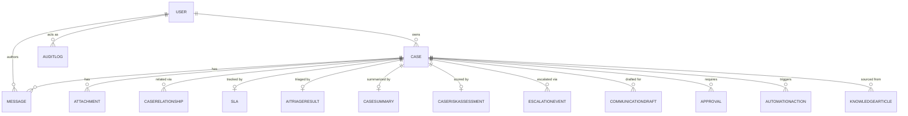
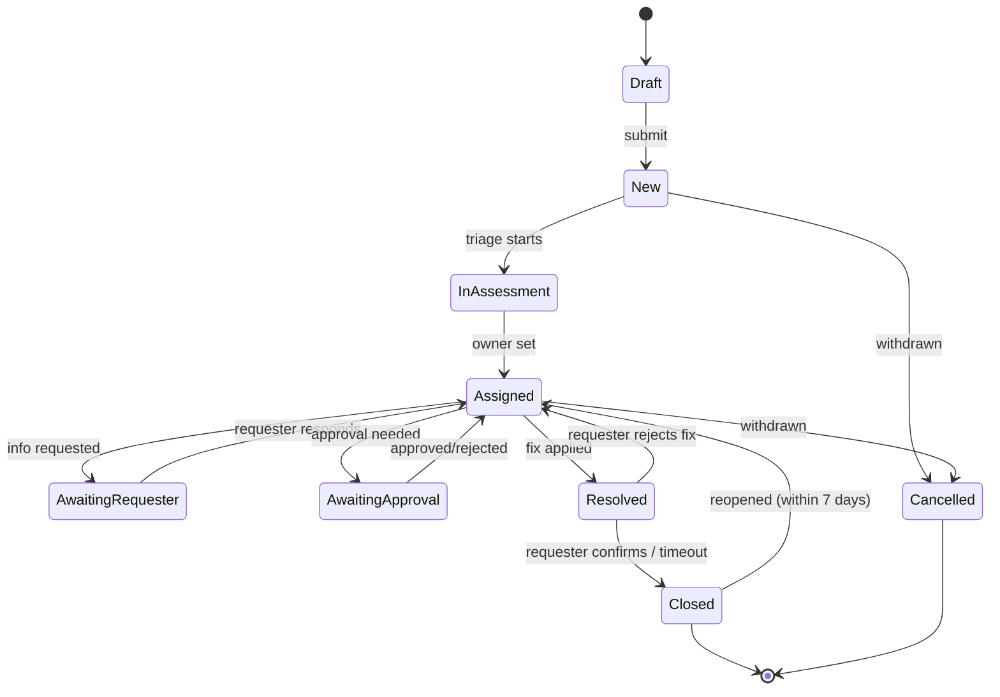

# AI IT Helpdesk — Software Requirements Specification (SRS)

**Version:** 3.3
**Status:** Merged and finalized for Phase 1 (college project) build
**Derived from:** AI IT Helpdesk SRS v1.0 → v2.0 (this document's direct ancestors), plus a client-provided 11-item automation feature list (paraphrased from a source referred to as "AI_Case_Manager_PRD_Production_Ready", not independently available), plus explicit build-environment decisions made during v3.0 scoping.
**Build target:** Written to be executed by an autonomous coding agent (Google Antigravity). Every requirement below is written to be unambiguous and independently verifiable — exact libraries, exact endpoints, exact fields — rather than left to interpretation.
**Author's note:** Items are tagged **[v1.0]** (unchanged since the original draft), **[v2.0]** (added in the second revision), **[v3.0]** (added or changed in the merge revision), **[v3.1]**/**[v3.2]** (subsequent auth/email/scope revisions), or **[v3.3]** (this revision — restores Google OAuth and splits email delivery by environment). Where a v3.0 item is an assumption rather than something explicitly confirmed, it is marked **[v3.0 — assumption, confirm]**.

---

## 0. Executive Summary

This SRS specifies an AI-assisted IT helpdesk system, built entirely on free-tier infrastructure, in two phases:

- **Phase 1 (this build, college project):** Incident and Service Request management with AI-assisted case analysis, summarization, duplicate detection, smart assignment, SLA/risk detection, escalation, AI-drafted communication, notifications, audit logging, and operational insights. Clients: Flutter mobile (Android + iOS), Flutter Desktop (Windows/macOS/Linux), and Flutter Web — one shared codebase, three build targets. Backend: FastAPI. Data: Supabase (Postgres + Storage). AI: Gemini.
- **Phase 2 (post-college, real deployment):** Adds Problem/Change/Major-Incident workflows and policy-gated automated remediation ("Controlled Auto-Fix"), plus items explicitly deferred below, without requiring a rewrite of Phase 1 code.

**[v3.0]** This project has **no heavy background processing, no long-running tasks, and no queued job workload**. Every automation feature either runs synchronously inside a request (case analysis, summarization, duplicate detection, AI drafting) or as a light periodic sweep (SLA/risk/escalation checks). Accordingly, this SRS does **not** include a worker service, a message queue, or Celery/Redis at any phase — that architecture would be over-engineering for this project's actual workload, not merely premature for Phase 1. See §3.5.

---

## 1. Introduction

### 1.1 Purpose
This SRS translates the product requirements (SRS v1.0/v2.0, plus the v3.0 automation feature list) into a buildable specification precise enough for an autonomous coding agent to implement without needing to guess at ambiguous details: architecture, data model, API conventions, concrete non-functional thresholds, and a phased delivery plan.

### 1.2 Scope
Covers the full product lifecycle: Incident and Service Request management in Phase 1, expanding to Problem/Change/Major-Incident workflows and controlled automation in Phase 2, with Future-scope items specified only at a directional level (see §6, Future scope).

### 1.3 Definitions and acronyms

| Term | Meaning |
|---|---|
| RLS | Row-Level Security (Postgres/Supabase access-control mechanism) |
| SLA | Service Level Agreement — target response/resolution time |
| RBAC | Role-Based Access Control |
| JWT | JSON Web Token |
| Auto-Fix | System-executed corrective action, gated by policy (Phase 2) |
| MI | Major Incident |
| FR / NFR | Functional Requirement / Non-Functional Requirement |
| **[v3.0]** Sweep | The single periodic APScheduler job that re-evaluates SLA, risk, and escalation state for all open cases — see §3.5, §5.7 |

### 1.4 References
- AI IT Helpdesk SRS v1.0, v2.0 (this document's direct ancestors)
- 11-item automation feature list provided by the project owner, §5
- Google Antigravity (build agent) — https://antigravity.google/

---

## 2. Overall Description

### 2.1 Product perspective **[v3.0 — revised]**
A single Flutter codebase compiled to three targets — Mobile (Android + iOS), Desktop (Windows/macOS/Linux via Flutter Desktop), and Web (Flutter Web) **[v3.0 — assumption, confirm: interpreted from "flutter app, desktop app, web-app" as one shared Flutter codebase rather than three separate frontend stacks]** — talks exclusively to a FastAPI backend. **Unlike SRS v2.0, there is no direct-from-client CRUD against Supabase.** Every read and write goes through FastAPI, so that:
- business logic (lifecycle rules, RBAC, SLA math, audit writes) lives in one place, not duplicated across three clients;
- the audit trail (§4, AuditLog) cannot be bypassed by a client writing straight to the database;
- the AI orchestration layer sits in front of every mutation that could trigger analysis, summarization, or risk recalculation.

Supabase is used purely as managed Postgres + Storage — a backend implementation detail, not a client-facing API.

### 2.2 User roles **[v3.0 — Manager promoted to full role]**
- **Requester** — submits and tracks own cases.
- **Operator** — works assigned cases, communicates with requesters.
- **Team Lead** — oversees a team's queue, reassigns within team.
- **Manager** — **[v3.0]** full cross-team authority: can reassign any case to any team/operator, can override case priority, views cross-team dashboards and Operational Insights (§5.12). Promoted from "schema-only, minimal UI" in v2.0 to a fully implemented Phase 1 role, per explicit decision.
- **Administrator** — user/team management, system configuration, audit log access.

Approver, Knowledge Owner, Service Owner, and Auditor remain schema-modeled with minimal UI, as in v2.0 — not requested for full implementation in this revision.

### 2.3 Assumptions and constraints **[v3.0 — expanded]**
- Single-organization deployment; multi-tenant SaaS is out of scope.
- **Entirely free-tier, start to finish** — local development through production deployment. This drives §3.2, §3.5, §3.9, §3.10, and §12 directly; every infrastructure choice below was selected to have a genuine $0 tier.
- AI provider (Gemini) is called via a thin internal `AIProvider` interface so the provider can be swapped without touching business logic.
- **No heavy background processing.** SLA/risk/escalation checks are periodic light sweeps (§3.5); AI calls are single-request, few-second operations run inline, not queued jobs.
- **[v3.0]** No business-hours calendar. SLA clocks run 24/7 on elapsed wall-clock time — confirmed decision, not a placeholder (contrast with v2.0 §4.3's original "business hours/business days" language, which this document replaces — see §4.3).
- **[v3.0]** Publishing the mobile app to Google Play (one-time $25) or Apple App Store ($99/yr) is the **only line item in this entire project that is not free**, and even that is optional — see §12.5. Everything else (Render, Supabase, Gmail SMTP, **[v3.3]** Brevo's free email tier, Google OAuth (no cost to register an OAuth client), Flutter Web hosting) has a genuine no-cost tier at this project's scale.

---

## 3. System Architecture

### 3.1 Component overview **[v3.0 — revised]**

| Component | Technology | Deployment (free tier) |
|---|---|---|
| Client (Mobile) | Flutter (Dart) — Android + iOS | Sideloaded APK / TestFlight-free or internal track for demo; store publish optional, §12.5 |
| Client (Desktop) | Flutter Desktop — Windows/macOS/Linux, same codebase | Distributed as downloadable build artifacts (e.g. GitHub Releases) |
| Client (Web) | Flutter Web, same codebase | Static hosting — Firebase Hosting free tier or equivalent |
| Backend API | Python, FastAPI | Render free web service |
| Database | PostgreSQL | Supabase (managed) |
| ORM **[v3.2]** | SQLAlchemy | Backend data models, query layer for `repositories/` |
| DB migrations **[v3.2]** | Alembic | Schema versioning, run against Supabase's connection string |
| File storage | Supabase Storage | Supabase |
| AI provider | Gemini API, behind an internal `AIProvider` interface | Called from FastAPI, synchronously per-request |
| Scheduled sweeps | APScheduler, in-process within the FastAPI service — **no separate worker** | Runs inside the same Render free web service |
| Email | **[v3.3]** Gmail SMTP in local dev / Brevo (HTTP API) in staging + production | Local: free Gmail account + app password. Staging/production: Brevo free tier, called via its HTTP API — not SMTP — so Render's outbound-SMTP-port restriction (§3.9) never applies where it matters |
| Auth | Custom JWT (access + refresh), Argon2id/bcrypt password hashing, **plus Google OAuth 2.0 / OIDC sign-in [v3.3 — restored; dropped in v3.1, reinstated here]**. **[v3.2]** Local and production use different settings — see §3.3a. | FastAPI issues/validates JWTs for both paths; a successful Google OAuth exchange results in the same access/refresh JWT pair as password login |

### 3.2 Environments
- **Local:** local Postgres (via `docker-compose`), `.env`-based secrets, mocked/sandboxed Gemini calls where practical to control cost during development, local disk or MinIO standing in for Storage. **[v3.3]** Email sends via Gmail SMTP (a developer's free Gmail account + app password) — works locally because the developer's own network doesn't block outbound SMTP ports. **[v3.3]** Google OAuth uses a "Testing" OAuth consent screen with `http://localhost:<port>` (or the Flutter dev redirect) registered as an authorized redirect URI.
- **Staging:** separate Supabase project, Render service, preview deployment of the Web client — used for pre-release verification, including an AI evaluation pass before any classification-logic change ships. **[v3.3]** Email sends via Brevo's HTTP API (same as production, so the delivery path is verified before go-live, not assumed). **[v3.3]** Google OAuth uses the same OAuth client as production, with the staging Web/redirect URL added to its authorized redirect URIs.
- **Production:** separate Supabase project, Render production service, production Web deployment, signed Mobile/Desktop builds. **[v3.3]** Email sends via Brevo's HTTP API. **[v3.3]** Google OAuth consent screen published (or kept in Testing with explicitly added test users, acceptable for a college-project audience), production redirect URIs registered.

### 3.3 Secrets and configuration
- Server-side credentials — DB connection string, JWT signing secret, Gemini API key, Supabase Storage credentials, plus **[v3.3]** `GOOGLE_OAUTH_CLIENT_ID` + `GOOGLE_OAUTH_CLIENT_SECRET`, and the environment-appropriate email credential (`GMAIL_SMTP_ADDRESS` + `GMAIL_SMTP_APP_PASSWORD` locally, `BREVO_API_KEY` in staging/production) — stored as environment variables in Render/Supabase dashboards — never committed to source control.
- **[v3.1]** Client-side (Mobile/Desktop/Web) configuration contains **no secrets** — only the public API base URL **and [v3.3]** the Google OAuth **client ID** (public by design for OAuth "installed app"/PKCE flows — the client secret never ships to a client). Anything shipped inside a Flutter binary or Web bundle is assumed readable by anyone; the JWT signing secret, Gemini key, Gmail app password, Brevo API key, and Google OAuth **client secret** must never appear in client code, build config, or `--dart-define` values checked into source control.
- JWT signing secret is high-entropy, rotated on any suspected compromise, with a rotation plan that invalidates outstanding refresh tokens.
- **Startup validation:** on boot, the backend validates that every required environment variable for its environment is present and non-empty — JWT secret, DB URL, Gemini API key, Supabase Storage credentials, and Google OAuth client ID/secret always; plus, **[v3.3]** environment-conditional, either the Gmail SMTP pair (local) or `BREVO_API_KEY` (staging/production) depending on `ENVIRONMENT`. If any required variable is missing, the app fails fast with a clear, named error listing exactly which variable is missing.

### 3.3a Auth — local vs. production settings **[v3.2 — new; updated v3.3 for OAuth + email-provider split]**
Auth supports **both** password (Argon2id/bcrypt + JWT) and Google OAuth (§3.1, §6) throughout, but the two environments run different settings so local development stays fast while production stays secure:

| Setting | Local | Production |
|---|---|---|
| Argon2id cost parameters | Reduced (e.g. memory ≥8 MiB, iterations 1) — fast hashing for rapid dev-cycle logins | Full §7.4 parameters (memory ≥19 MiB, iterations 2, parallelism 1) |
| Email verification (password signups) | Not enforced — seeded/dev accounts can act on cases immediately | Enforced per §6's email-verification requirement |
| **[v3.3]** Email verification (Google OAuth signups) | Never required — Google has already verified the email address as part of the OAuth handshake; `email_verified` is set `true` at account creation regardless of environment | Same — never required |
| JWT access token expiry | Longer (e.g. 24 hours) — avoids re-login friction while developing | 15 minutes, per §7.4 |
| Rate limiting (§7.3) | Disabled or very high limits | Full §7.3 limits enforced |
| **[v3.3]** Email provider (verification links, notifications) | Gmail SMTP (free Gmail account + app password) | Brevo HTTP API |
| **[v3.3]** Google OAuth consent screen | "Testing" mode, `localhost` redirect URI | Published (or Testing + explicit test users), production redirect URI |

Both environments are driven by the same code paths — the `AuthProvider`/OAuth exchange logic and the `NotificationProvider` interface (§11) are identical across environments; only the underlying credentials and provider implementation differ, selected by `ENVIRONMENT` and sourced from `.env` (local) vs Render's environment variables (staging/production) — so there is no separate "local auth module" or "local email module" to maintain.

### 3.4 Deployment automation **[v3.2 — CI/CD removed]**
No CI/CD pipeline in this project — builds, tests, and deploys are run manually/on-demand by the developer (via `pytest`, `flutter test`, `flutter build`, and Render's manual/git-push deploy). If a pipeline is wanted later, GitHub Actions remains the natural free-tier choice, but it is not part of this SRS's Phase 1 or Phase 2 scope.

### 3.5 Background processing — no worker, no queue **[v3.0 — replaces v2.0 §3.4a entirely]**
This project has no workload that justifies a separate worker process, message broker, or job queue (Celery/Redis/n8n). Confirmed explicitly, not deferred as a "maybe later" — see §2.3.

- **Synchronous AI operations** (case analysis on creation, summarization on new message, duplicate detection, missing-info detection, assignment recommendation, communication drafting) run **inline inside the relevant FastAPI request handler**, calling Gemini directly and returning the result (or a documented fallback, §7.7) in the same response. Each is a single API call, not a multi-step pipeline — no queueing needed.
- **Periodic evaluation** (SLA breach detection, risk scoring, escalation triggers — collectively "the Sweep", §5.7–5.8) runs as a single **APScheduler** job, in-process inside the same Render web service, on a fixed interval (default every 5 minutes, configurable). This requires no additional infrastructure.
- **Known limitation, accepted for Phase 1:** Render's free tier spins the service down after ~15 minutes of inbound-request inactivity. A sleeping service does not run its in-process scheduler. The Sweep resumes on the next inbound request (which wakes the service), so a breach/escalation can be detected late by however long the service was asleep. **Mitigation (optional, Phase 1):** an external free uptime pinger (e.g. UptimeRobot's free tier) hitting `GET /api/v1/health` (§3.8) every 10 minutes keeps the service — and therefore the Sweep — awake during expected usage windows. This is documented as an accepted tradeoff, not silently ignored.
- **This holds for Phase 2 as well** — there is no scenario in this project's functional scope (§6) that produces a genuinely long-running or heavy-queue workload. If that changes, introducing a worker is a future architectural decision outside this SRS's scope, not a pre-planned upgrade path.

### 3.6 API Conventions
- **Versioning:** all backend routes prefixed `/api/v1/...`. A breaking response-shape change requires `/api/v2/...`, never a silent change to `v1`.
- **Pagination:** list endpoints accept `?page=<int>&page_size=<int>` (default `page_size=20`, max `100`), returning:
  ```json
  { "items": [ ... ], "page": 1, "page_size": 20, "total": 137 }
  ```
- **Error envelope:**
  ```json
  { "error": { "code": "VALIDATION_ERROR", "message": "Human-readable summary", "details": { } } }
  ```
  `code` is a stable machine-readable string (`NOT_FOUND`, `PERMISSION_DENIED`, `VALIDATION_ERROR`, `AI_PROVIDER_UNAVAILABLE`, `STALE_VERSION`); `message` is safe to show a user; `details` carries field-level validation errors.
- **Export format:** CSV only in Phase 1; PDF is Phase 2.
- **Idempotency [v3.0]:** every mutating endpoint that a client might retry after a timeout (case creation, message send, attachment upload) accepts an optional `Idempotency-Key` header; the backend stores the key against the resulting resource for 24 hours and returns the original result on a repeat with the same key, rather than creating a duplicate. This matters more here than in a typical web app because Mobile/Desktop clients retry more aggressively on flaky networks.

### 3.7 CORS
Backend allows cross-origin requests only from known Web-client origins (staging and production Flutter Web hosting URLs, plus `localhost` in dev), configured via `ALLOWED_ORIGINS` — never a wildcard `*`. Mobile/Desktop clients are not browser-based and are unaffected by CORS.

### 3.8 Health check
`GET /api/v1/health` returns `200 OK` with `{"status": "ok", "db": "ok"|"error"}`, checking DB connectivity but never calling Gemini (avoids burning AI quota on uptime pings). Used by Render's own health checks and the optional external pinger in §3.5.

### 3.9 Email delivery — Gmail SMTP (local) / Brevo (staging + production) **[v3.3 — replaces v3.1's single-provider, accepted-risk approach]**
All email sends — verification links, notifications (§5.10), password-reset — go through a single `NotificationProvider` interface (§11), so the backend code that triggers a send never knows or cares which concrete provider is behind it. Two implementations exist behind that interface, selected by `ENVIRONMENT` at startup:

- **Local (`GmailSmtpNotificationProvider`):** sends via **Gmail SMTP** (a free Gmail account + app password, using Python's built-in `smtplib`/`email` modules or `aiosmtplib`). This is fine locally because the developer's own machine/network does not block outbound SMTP ports (25/465/587).
- **Staging + Production (`BrevoNotificationProvider`):** sends via **Brevo's transactional-email HTTP API** (free tier), authenticated with `BREVO_API_KEY`. This is an HTTP `POST` over 443, not SMTP, so it is unaffected by **Render's free-tier restriction on outbound SMTP ports** — the exact problem v3.1 flagged as an "accepted risk" for Gmail SMTP in production. **[v3.3]** rather than accept that risk and fall back only if it fails, this revision routes staging and production through Brevo from the start; Gmail SMTP is scoped to local development only, where the port restriction doesn't apply.

Both providers are called synchronously, inline at the point the triggering event occurs (case created, assigned, SLA warning, etc. — full list in §5.10, §6) — no queue needed, consistent with §3.5. Delivery failures are handled per §7.7/§7.14 (logged, retried, never block the triggering action) regardless of which provider is active.

**Email verification and password-reset links (§6):** generated and sent the same way — a signed, time-limited link, delivered via whichever `NotificationProvider` implementation is active for the environment. Google OAuth signups never trigger a verification email (§3.3a) since Google has already verified the address.

---

## 4. Data Model (high-level entities)

| Entity | Key fields | Notes |
|---|---|---|
| **User** | id, email, password_hash **[v3.3 — nullable again: an OAuth-only account may have no password]**, `auth_provider` **[v3.3 — new]** (enum: `password`, `google`), `oauth_subject_id` **[v3.3 — new]** (nullable; Google's stable `sub` claim, unique per provider — used to match a returning OAuth login), role (Requester/Operator/TeamLead/Manager/Administrator), team_id, `site` **[v3.0]**, `availability_status` **[v3.0]** (available/away/offline, self-set), email_verified, created_at | `site` and `availability_status` feed Smart Assignment (§5.6). A row has either a non-null `password_hash` (auth_provider=`password`) or a non-null `oauth_subject_id` (auth_provider=`google`), or both if the same person later links both methods (linking is out of scope for Phase 1, §7.4). |
| **Case** | id, reference_number, type (Incident/Service Request/Problem/Change), title, description (immutable), status, priority, owner_id, team_id, `site` **[v3.0]** (inherited from requester at creation), service_id, version (optimistic locking), created_at, resolved_at, closed_at, deleted_at (soft delete) | Central record. |
| **CaseRelationship** | case_id, related_case_id, relationship_type | "related to," "duplicate of," "part of Major Incident." |
| **Message / Note** | case_id, author_id, body, visibility (`requester_visible` \| `internal_only`), ai_generated (bool), created_at | `requester_visible` shown to Requester + all staff; `internal_only` never returned to a Requester, including via export or AI context. |
| **Evidence/Attachment** | id, case_id, storage_path, file_type, size, uploaded_by, created_at | Server-generated UUID storage filename. |
| **SLA** | case_id, target_response_at (UTC), target_resolve_at (UTC), breached (bool), paused_reason | 24/7 elapsed-time math — see §4.3. |
| **Approval** | id, case_id, approver_id, decision, reason, decided_at | |
| **AITriageResult** **[v3.0 — extended]** | case_id, suggested_category, suggested_severity **[v3.0]**, suggested_priority, confidence_level (enum Low/Moderate/High), confidence_score (internal only), supporting_factors, missing_info, suggested_team **[v3.0]**, recommended_next_action **[v3.0]**, related_case_ids **[v3.0]**, created_at | Maps directly to automation item 1, §5.2. Confidence is *shown* only as the enum, never a bare number. |
| **CaseSummary** **[v3.0 — new]** | case_id, summary_text, last_source_message_id, updated_at | Continuously maintained AI summary — automation item 2, §5.3. |
| **CaseRiskAssessment** **[v3.0 — new]** | case_id, risk_level (enum Low/Moderate/High/Critical), signals (jsonb: inactivity_hours, follow_up_count, reassignment_count, missing_info_flag, hours_to_deadline, reopen_count), computed_at | Produced by the Sweep — automation item 6, §5.7. |
| **EscalationEvent** **[v3.0 — new]** | id, case_id, trigger_reason (enum: approaching_deadline/missed_deadline/high_risk/repeated_reopen/operator_requested), escalated_to (user_id or role), escalated_by (`system` or user_id), status (open/acknowledged/resolved), created_at | Automation item 7, §5.8. |
| **CommunicationDraft** **[v3.0 — new]** | id, case_id, draft_type (info_request/progress_update/resolution/escalation_summary), body, status (draft/sent/discarded), reviewed_by, sent_message_id (nullable), created_at | Automation item 8, §5.9 — AI drafts, human reviews/edits before send; never auto-sent. |
| **AuditLog** | id, actor_id (nullable for system-triggered events), action, target_type, target_id, before_value, after_value, created_at | Append-only; no update/delete at the application layer. `actor_id` is null for Sweep-triggered events (e.g. automatic escalation), distinguishing system actions from human ones. |
| **AutomationAction** *(Phase 2)* | id, case_id, action_type, status, whitelisted (bool), verification_result | Level 3 Controlled Auto-Fix, deferred. |
| **KnowledgeArticle** | id, title, body, owner_id, state, review_date, source_case_id | |

### 4.1 Entity-relationship overview



### 4.2 Case reference number format
Server-generated at creation: `<TYPE>-<YEAR>-<sequential>`, e.g. `INC-2026-000123`. The UUID `id` is the internal/API key; `reference_number` is what's shown in UI, search, and notifications.

### 4.3 SLA model — 24/7 elapsed time **[v3.0 — replaces v2.0's business-hours language]**

| Priority | Target first response | Target resolution |
|---|---|---|
| P1 — Critical | 15 minutes | 4 hours |
| P2 — High | 1 hour | 8 hours |
| P3 — Medium | 4 hours | 3 days (72 hours) |
| P4 — Low | 1 business day → **24 hours** | 5 days (120 hours) |

All targets are **pure elapsed wall-clock time** from `created_at` — no business-hours calendar, no weekend/holiday pausing. This is a confirmed project decision, not a placeholder: it removes an entire category of complexity (holiday calendars, per-region working hours) that this project does not need. If a genuine support-desk deployment later requires business-hours SLAs, that is an explicit, separate future change, not something this SRS assumes.

---

## 5. AI Capabilities **[v3.0 — reorganized around the 11-item automation list, replacing v2.0 §5's "Automation Levels" framing while keeping its Level 0–3 table]**

### 5.1 Automation levels (unchanged definition)

| Level | Definition | Phase |
|---|---|---|
| 0 | Pure insight — AI surfaces information, no suggested action | 1 |
| 1 | Recommendation — AI suggests something; a human must explicitly accept it | 1 |
| 2 | Workflow automation — visible, reversible, non-destructive system action, logged and undoable | 1 |
| 3 | Controlled Auto-Fix — system executes a corrective action, gated by whitelist/confidence/approval, with verification and rollback | 2 |

### 5.2 Automatic AI Case Analysis — Level 1, Phase 1
On case creation, the backend calls Gemini synchronously with the case title/description and returns: suggested category, severity, priority, missing information, candidate related/duplicate cases (via §5.5's mechanism), suggested team, and a recommended next action. Stored as `AITriageResult` (§4). All fields are suggestions surfaced to a human — none are auto-applied to the case record.

### 5.3 Automatic Case Summarization — Level 0, Phase 1
Every time a new `requester_visible` or `internal_only` message is added to a case, the backend recomputes the `CaseSummary` inline (single Gemini call, case history + new message as context) covering: what was reported, what happened since, what's confirmed, what remains unresolved. This is synchronous-on-write, not a background job — consistent with §3.5's no-queue architecture.

### 5.4 Automatic Missing Information Detection — Level 1, Phase 1
Part of the same `AITriageResult` analysis (§5.2) and re-evaluated whenever the case updates materially (new message, status change). Surfaced to the Operator as suggested questions to send the requester — feeds directly into §5.9's drafting.

### 5.5 Automatic Related/Duplicate Case Detection — Level 0, Phase 1
Postgres `pg_trgm` trigram similarity + `tsvector` full-text search over `title` + `description` within the same `service_id`, surfaced as candidates above a similarity threshold for human confirmation only — no automatic linking. (Sufficient at demo scale; avoids standing up a separate search service.)

### 5.6 Smart Assignment Recommendation — Level 1, Phase 1 **[v3.0 — new]**
On case creation (as part of the same synchronous analysis pass as §5.2), the backend recommends a team and/or operator by combining: `AITriageResult.suggested_team`, current open-case count per candidate operator (workload), `User.availability_status`, `User.site` matched against `Case.site` where relevant, and the requester's prior case history. This is a **recommendation only** — assignment is confirmed by an Operator/Lead/Manager, never auto-applied (consistent with Level 1).

### 5.7 Automatic SLA and Risk Detection — Level 0/1, Phase 1 **[v3.0 — new, part of "the Sweep"]**
The periodic APScheduler job (§3.5) evaluates every open case against: inactivity duration, repeated follow-ups from the requester, reassignment count, missing-info flag, hours remaining to SLA deadline, and reopen count. Writes a `CaseRiskAssessment` (§4) with a Low/Moderate/High/Critical `risk_level`. Feeds §5.8 escalation and is surfaced on staff dashboards — never shown to Requesters as a raw score.

### 5.8 Escalation Automation — Level 1/2, Phase 1 **[v3.0 — new, part of "the Sweep"]**
The same Sweep raises an `EscalationEvent` when any of: SLA approaching (configurable lead time, default 20% of remaining target window) or missed; `risk_level` reaches High/Critical; a case has been reopened more than once; or an Operator explicitly requests managerial help (a direct user action, Level 2 — always human-triggered, never automatic). Escalation targets the case's Team Lead first, then Manager if unacknowledged within a configurable window (default 2 hours). Every `EscalationEvent` is an `AuditLog` entry.

### 5.9 AI-Generated Communication — Level 1, Phase 1 **[v3.0 — new]**
On request (Operator/Lead action, not automatic), the backend generates a `CommunicationDraft` (info request, progress update, resolution message, or escalation summary) via a single Gemini call using case context. The draft is never sent automatically — the Operator reviews, may edit the body, then explicitly sends, at which point it becomes a `Message` with `ai_generated = true` (visibly labeled, per §4).

### 5.10 Automated Notifications — Phase 1 **[v3.0 — event list expanded; v3.3 — email provider split by environment]**
In-app + email (Gmail SMTP locally / Brevo in staging+production, §3.9) for: case created, case assigned, requester replied, new task assigned, SLA warning, SLA breach, escalation raised, case resolved, case reopened. Delivered inline at the point the triggering event occurs (no queue) — see §3.5, §7.7 for the AI-unavailable and delivery-failure fallback behavior.

### 5.11 Automatic Case Timeline and Audit Logging — Phase 1
Every material action (assignment, status change, AI recommendation generated/accepted, escalation raised, resolution, reopening, closure) writes an `AuditLog` entry automatically as part of the same transaction as the action itself — never a separate, skippable step.

### 5.12 AI-Powered Operational Insights — Phase 1 **[v3.0 — moved from Phase 2 per explicit decision]**
A reporting endpoint (Manager/Administrator only) aggregates closed/open case data to surface trends: rising complaint volume by category, by site, or by team, over a selectable time window. Phase 1 scope is **aggregate SQL queries against existing tables** (case counts, reopen rates, category/site breakdowns) — not a separate analytics pipeline or a new AI model; "AI-powered" here means the same Gemini call that already has case context can be asked to narrate a plain-language summary of the aggregated numbers, not that trend detection requires new infrastructure.

### 5.13 Confidence-level thresholds

| Confidence level shown to user | Underlying `confidence_score` range (Phase 1 default) |
|---|---|
| Low | 0.00 – 0.49 |
| Moderate | 0.50 – 0.79 |
| High | 0.80 – 1.00 |

Starting defaults — §8's AI validation row requires tracking false-confidence rate and adjusting from real data.

### 5.14 Search mechanism
Phase 1 keyword search and duplicate detection both use Postgres native full-text search (`tsvector`/`tsquery`, `GIN` index) plus `pg_trgm`. Sufficient at demo scale; avoids a separate search service.

### 5.15 Prompt-injection handling
Requester-supplied text passed into any AI prompt (§5.2–5.9) is treated as untrusted data, not instructions — the system prompt explicitly instructs the model to ignore embedded instructions in requester text. AI output that would change case metadata is always Level 0–1 (suggestion surfaced to a human), never auto-applied — bounding the damage even if injection is attempted.

---

## 6. Functional Requirements by Phase

> **Requirement-ID convention:** each bullet is implicitly `FR-<phase>-<n>` in delivery order; explicit IDs are assigned in the project's issue tracker at implementation time.

### Phase 1 — MVP (college project)

- Auth: email/password (Argon2id/bcrypt + JWT access/refresh) **plus Google OAuth 2.0/OIDC sign-in [v3.3 — restored, having been dropped in v3.1]** — both paths issue the same access/refresh JWT pair, and both are available on all three client targets (Mobile/Desktop/Web)
- Email verification: **password** signups require verifying the email address (signed, time-limited link, sent via the environment's `NotificationProvider`, §3.9) before creating/acting on cases. **[v3.3]** Google OAuth signups skip this step — `email_verified` is set `true` at account creation, since Google has already verified the address as part of the OAuth flow.
- RBAC enforcement at the API layer for all endpoints, for Requester/Operator/TeamLead/Manager/Administrator (§2.2)
- Session handling: multi-device sessions; "log out of all devices" revokes every refresh token
- Unified Case model: Incident and Service Request types only
- Full lifecycle: Draft → New → In Assessment → Assigned → Awaiting Requester/Approval → Resolved → Closed, plus Cancelled and Reopen (§6.1 diagram)
- Reopen rules: original Requester or any Operator/Lead within 7 calendar days of `closed_at`; resets to `Assigned`, starts a new SLA clock
- All eleven AI capabilities in §5, at the levels and phases specified there
- SLA timers: 24/7 elapsed time (§4.3), evaluated by the Sweep (§3.5, §5.7)
- Search: keyword, case reference lookup, filters, saved operator views (§5.14)
- Case communication: requester-facing messages, internal notes, clearly labeled AI-drafted replies
- Basic knowledge base: manually authored articles, no AI-drafting yet
- Role-specific dashboards: Requester, Operator, Lead, Manager **[v3.0]**, Administrator
- Audit logging for all material events (§5.11)
- Failure/fallback states (§9)
- File attachments via Supabase Storage, constraints in §7.5
- Notification channels: in-app + email (Gmail SMTP) **[v3.2 — push/FCM removed from scope]**
- **[v3.0]** Three client targets from one Flutter codebase: Mobile (Android + iOS), Desktop, Web (§3.1)

### Phase 2 — Operational intelligence and governed action (post-college, real deployment)

- Level 3 Controlled Auto-Fix: whitelist/policy engine, authorization step, verification, logging, failure intervention, rollback/recovery
- Major Incident workspace: declaration, coordinated response, approved status communications
- Problem management workflow: hypothesis vs. confirmed root cause, linked Incidents
- Change management workflow: impact/risk/approval/validation/rollback evidence
- Known errors/workarounds
- AI-assisted knowledge drafting (still human-published, never auto-published)
- Governed integrations: identity/directory sync, collaboration tool notifications (Slack/Teams), basic endpoint/asset info
- Formal data retention/deletion policy implementation and PDF export support (§7.10, §3.6)
- **[v3.0]** *Not* included: any worker/queue/broker introduction — explicitly ruled out for this project at any phase, §3.5

### Future scope (directional only)

- Natural-language discovery across all permitted operational content, with citations and permission-awareness
- Deep CMDB, monitoring, procurement, and security-tool integrations
- Predictive risk/capacity analytics beyond §5.12's aggregate reporting
- Multi-organization SaaS controls
- Carefully expanded low-risk orchestration, only after Phase 2's automation has demonstrated measurable safety/reliability

### 6.1 Case lifecycle state diagram



---

## 7. Non-Functional Requirements

### 7.1 Performance
- API p95 response time < 2s for non-AI endpoints
- AI-invoking endpoints: visible "pending" state in the UI if the Gemini call exceeds ~3s, rather than a frozen screen — still synchronous (§3.5), just UI-acknowledged
- Load testing (`k6`/`Locust` against staging) verifies the p95 target before each phase milestone

### 7.2 Input validation
- All request bodies validated via Pydantic models with `extra="forbid"`
- Explicit max lengths: case title ≤200 chars, description ≤10,000 chars, notes ≤5,000 chars
- HTML sanitization (`bleach`) on any user text rendered as rich text
- Parameterized queries only

### 7.3 Rate limiting

| Endpoint class | Limit |
|---|---|
| Standard authenticated endpoints | 100 req/min per user |
| Auth endpoints (login, password reset) | 5–10 req/min per IP |
| AI-invoking endpoints | 20 req/min per user |
| Unauthenticated endpoints | 30 req/min per IP |

### 7.4 Password and token standards
- Argon2id preferred (memory ≥19 MiB, iterations 2, parallelism 1) or bcrypt cost ≥12
- Minimum password length 12 characters
- JWT access token: 15-minute expiry; refresh token 7–30 days, stored hashed, rotated on use, revocable
- **[v3.3 — reverses v3.1]** Dual auth paths: password accounts have a non-null `password_hash` (hashed as above); Google OAuth accounts are distinguished by `auth_provider='google'` and a non-null `oauth_subject_id` (§4) and may have `password_hash = null`. Google's authorization-code flow (with PKCE for Mobile/Desktop clients, standard flow for Web) is exchanged server-side for the user's Google profile (email, verified-email flag, subject id), which the backend uses to create or look up the `User` row and issue the same JWT pair as password login. Automatically linking an OAuth login to an existing password account by matching email is **out of scope for Phase 1** — a Google sign-in with an email that already has a password account is treated as a conflict (`409`, clear error) rather than silently merged, to avoid an account-takeover vector; explicit account linking is a future enhancement, not assumed here.

### 7.5 File upload constraints
- Max 10MB per file, 50MB per case total
- Allowlist: jpg, png, webp, gif, pdf, docx, txt, log — reject all else
- Validate actual file content/magic bytes, not extension alone
- Server-generated UUID storage filenames
- Malware scanning: required before Phase 2 real deployment, optional for Phase 1 demo

### 7.6 Security and access control **[v3.0 — revised for the no-direct-Supabase-access model]**
- All access control is enforced at the FastAPI layer, since clients never talk to Supabase directly (§2.1) — Supabase RLS is **not** relied upon as a security boundary in this architecture (unlike v2.0's dual-layer design), simplifying the auth model to one enforcement point.
- Every restricted view (case detail, search results, exports, AI context) independently enforces the same permission check.
- Exports are subject to the same permission/visibility rules as underlying data — never surface `internal_only` messages to a Requester.

### 7.7 Reliability
- Core case CRUD, auth, and audit logging remain functional if Gemini is unavailable — AI features degrade to an explicit "unavailable" state (§9), never block core workflow.
- **[v3.2]** Email delivery failures never block or roll back the underlying event — a failed notification is logged and retried on the endpoint's normal retry policy (§7.13), not treated as a transaction failure.

### 7.8 Accessibility **[v3.0 — per client target]**
- Mobile: TalkBack (Android) / VoiceOver (iOS) compatibility, semantic labels on all interactive widgets
- Desktop/Web: full keyboard navigation, accessible labels/error messages, non-color-only status indicators
- All three: screen-reader compatibility via Flutter's `Semantics` widgets throughout

### 7.9 Observability
- Structured logging (JSON) from FastAPI, shipped to Render's log stream at minimum
- Track: AI call success/failure rate, AI response latency, SLA breach count, escalation count, Sweep run duration
- Health check per §3.8

### 7.10 Data retention and deletion
- `Case` and `User` deletes are soft deletes only (`deleted_at` set) — never a hard `DELETE`
- Hard deletion for legitimate erasure requests is a Phase 2 requirement, alongside a formal retention policy

### 7.11 Timezone handling
All timestamps stored and computed in UTC. Clients convert to local timezone for display only — no scheduling, breach-detection, or escalation logic ever compares against a non-UTC time.

### 7.12 Concurrency
`Case` carries a `version` integer. Updates include the version they read; a mismatch is rejected with `409 Conflict` (`STALE_VERSION`), never a silent overwrite. Clients surface this as "this case was updated by someone else — reload to see the latest."

### 7.13 Free-tier operational limits and mitigations **[v3.0 — new]**

| Constraint | Mitigation |
|---|---|
| Render free web service spins down after ~15 min idle | Accepted for Phase 1; optional external pinger keeps the Sweep timely (§3.5) |
| Supabase free-tier project pauses after 7 days with zero activity | Documented risk for long idle periods between demo sessions; a manual "wake" request (any API call) resumes it — no code change needed, just awareness |
| Render free tier blocks outbound SMTP ports | **[v3.3]** Resolved by design rather than accepted as risk: staging/production send email via Brevo's HTTP API (§3.9), not SMTP; Gmail SMTP is scoped to local dev only, where the block doesn't apply |

### 7.14 Retries and idempotency **[v3.0 — new]**
- Mutating endpoints support `Idempotency-Key` (§3.6).
- Gemini calls: one retry with exponential backoff (base 1s) on transient failure (timeout, 5xx) before falling back to the "AI unavailable" state (§9) — never more than one retry, to keep p95 latency bounded (§7.1).
- Email sends: retried up to 3 times with backoff; a final failure is logged, not surfaced as a user-facing error for the triggering action.

### 7.15 Client connectivity behavior **[v3.0 — new]**
- Mobile/Desktop/Web clients show an explicit "offline" or "connection lost" state when the API is unreachable, and disable mutating actions (submit, send, assign) until connectivity returns.
- Previously loaded data (case list, case detail) remains visible read-only from local cache while offline.
- Offline action queuing (submit while offline, sync later) is **out of scope for Phase 1** — explicitly deferred, not silently assumed.

---

## 8. Testing Strategy

| Layer | Tooling | Coverage focus |
|---|---|---|
| Unit (backend) | `pytest` | Confidence scoring, SLA calculation, lifecycle state-transition rules, validation logic. Target: ≥80% line coverage on `services/`. |
| Unit (client) | `flutter test` | Widget tests, state-management logic, shared business logic used across the three build targets |
| Integration (backend) | `pytest` + FastAPI `TestClient`/`httpx` | Full request→DB flows; permission enforcement (cross-user access denial tests) |
| Integration (client) | `integration_test` (Flutter) | Key flows on at least one build per target (Mobile, Desktop, Web) |
| Load | `k6` or `Locust` against staging | Verifies p95 < 2s (§7.1) under realistic concurrent load |
| Security | `pip-audit`/`npm audit` equivalents, manual OWASP Top 10 pass, token expiry/revocation tests | SQLi, XSS, broken auth, IDOR |
| AI validation | Held-out labeled ticket set | Classification accuracy, false-confidence rate over time; human review before any classification-logic change ships |

### 8.1 AI prompt versioning
Gemini prompt templates live in `backend/ai/` as version-controlled files, each carrying a version tag. A prompt change is a normal, reviewable pull request; the AI validation pass (above) runs against the new prompt version before it ships.

### 8.2 Multi-user end-to-end / UAT plan **[v3.0 — new; v3.3 adds the auth-path check]**
Before the Phase 1 demo: a scripted multi-user session with at least one real account per role (Requester, Operator, Team Lead, Manager, Administrator) exercising, in sequence: case submission → AI analysis/assignment recommendation → assignment → AI-drafted info request → requester reply → summary update → SLA warning → escalation → resolution → requester confirmation → close → reopen within window. Concurrency case: two staff accounts editing the same case simultaneously, verifying `STALE_VERSION` (§7.12) fires correctly. **[v3.3]** Auth case: at least one account signs up/logs in via password (confirming the email-verification link arrives and works), and at least one via Google OAuth (confirming the account is created pre-verified and receives a working JWT pair) — both against the actual deployed environment, not mocked. Each scenario has a written pass/fail checklist, signed off before the deployment milestone in §12.

---

## 9. Failure and Fallback Requirements

- **AI unavailable:** case creation, message send, and all other flows succeed without AI output; the UI shows an explicit "AI analysis unavailable" state instead of blocking or silently omitting the section.
- **Notification delivery failure:** logged, retried per §7.14, never blocks the triggering action.
- **Search/duplicate-detection unavailable:** case creation still succeeds; duplicate suggestions simply don't appear.
- **Permission-restricted:** a clear "you don't have access" state, not a generic error.
- **Validation conflict (`STALE_VERSION`):** explicit reload prompt, §7.12.
- **Client offline (§7.15):** explicit offline state, mutating actions disabled, cached data still viewable.
- **Empty state / loading state:** every list/dashboard has an explicit empty state and loading state in the component library from the start.

---

## 10. Risks

| Risk | Mitigation |
|---|---|
| Gemini API cost/latency at scale | Rate limiting on AI endpoints (§7.3); one retry then fallback (§7.14) |
| **[v3.3]** Google OAuth consent-screen/redirect-URI misconfiguration (wrong redirect URI per environment, unpublished consent screen blocking non-test users) | §3.2/§3.3a call out per-environment redirect URIs explicitly; §8.2 UAT exercises OAuth login before demo |
| **[v3.3]** Brevo free-tier sending limits (daily cap) exceeded during heavy demo/testing | Low volume at this project's scale (§13); monitor via Brevo's dashboard; §7.14's retry/log behavior means a rate-limited send degrades gracefully, not silently |
| Render free-tier spin-down delaying the Sweep | Documented limitation + optional external pinger (§3.5, §7.13) |
| Supabase free-tier project pausing on inactivity | Documented; manual wake, no code impact (§7.13) |
| Scope creep from Phase 1 into "everything at once" | Phase boundaries in §6 are binding for the college-project milestone |
| Confidence thresholds (§5.13) and SLA targets (§4.3) are launch defaults, not tuned/negotiated values | Revisit both against real labeled data before treating them as fixed |
| Three-target Flutter build (Mobile/Desktop/Web) increases per-feature QA surface | §8's integration testing explicitly covers at least one build per target, not Mobile only |
| Automatic escalation (§5.8) mis-triggering on noisy signals | Sweep thresholds are configurable, not hard-coded; §8.2's UAT plan explicitly exercises the escalation path before demo |

---

## 11. Detailed Project Folder Structure

Layered backend: `API routes → Services → Repositories/Data Access → Database`, with swappable **providers** for AI, Storage, Auth, Notifications (email), each behind an interface. Single Flutter repo, feature-organized, with platform-specific build config.

```text
project-root/
├── client/                            # Single Flutter codebase → Mobile, Desktop, Web
│   ├── lib/
│   │   ├── main.dart
│   │   ├── app/                       # routing, theming
│   │   ├── features/                  # one folder per feature
│   │   │   ├── auth/
│   │   │   ├── cases/                 # list, detail, create, lifecycle actions
│   │   │   ├── ai/                    # triage panel, summary view, draft review, risk badge
│   │   │   ├── notifications/         # in-app inbox
│   │   │   ├── dashboard/             # per-role dashboard widgets, incl. Manager insights view
│   │   │   └── admin/                 # user/team management, audit log viewer
│   │   ├── shared/                    # api_client.dart, models, widgets/, theme
│   │   └── platform/                  # platform-specific glue (build config per target)
│   ├── android/ ios/ windows/ macos/ linux/ web/   # Flutter's own per-target build folders
│   ├── test/                          # flutter test (unit + widget)
│   ├── integration_test/
│   └── pubspec.yaml
│
├── backend/                           # FastAPI app
│   ├── api/                           # route handlers only — no business logic
│   │   ├── auth/ cases/ messages/ attachments/ knowledge/ sla/
│   │   ├── ai/                        # analysis, summary, duplicate, assignment, draft endpoints
│   │   ├── notifications/ admin/ reports/
│   │   └── health.py                  # GET /api/v1/health
│   ├── core/                          # config, security primitives, startup env-var validation
│   ├── models/                        # ORM models
│   ├── schemas/                       # Pydantic request/response schemas
│   ├── services/                      # business logic — lifecycle, SLA math, RBAC, the Sweep's logic
│   ├── repositories/                  # only layer that talks to the DB
│   ├── providers/                     # swappable interfaces
│   │   ├── ai/                        # AIProvider interface + GeminiProvider
│   │   ├── storage/                   # StorageProvider + SupabaseStorageProvider
│   │   ├── auth/                      # JWT + password hashing + Google OAuth2/OIDC exchange [v3.3]
│   │   └── notifications/             # NotificationProvider — Gmail SMTP (local) / Brevo HTTP API (staging+prod) [v3.3]
│   ├── ai/                            # prompt templates (versioned, §8.1), structured-output schemas
│   ├── audit/                         # append-only audit writer
│   ├── scheduler/                     # APScheduler setup + the Sweep job definition (§3.5, §5.7-5.8)
│   ├── db/
│   │   ├── migrations/                # Alembic
│   │   └── session.py
│   ├── tests/
│   │   ├── unit/ integration/ load/ security/
│   ├── main.py
│   ├── .env.example
│   └── requirements.txt / pyproject.toml
│
├── docs/
│   ├── SRS.md                         # this document
│   └── adr/                           # architecture-decision notes
│
├── scripts/
│   └── seed_demo_data.py              # seeds Users (one per role), ~15-20 Cases across lifecycle
│                                       # states, sample Messages/Attachments/AITriageResults/
│                                       # CaseSummaries/CaseRiskAssessments so every dashboard
│                                       # (including Manager Operational Insights) shows non-empty data
│
├── docker-compose.yml                 # local dev: backend + local Postgres
├── backend/Dockerfile
├── .gitignore
└── README.md
```

### 11.1 README scope
Covers: what the project is (1 paragraph), stack summary, local setup (clone → env vars needed, listed by name → install → run migrations → run dev servers → run `flutter run` per target), how to run tests, link to this SRS.

---

## 12. Deployment — local free-tier-first to production **[v3.0 — new, consolidated]**

### 12.1 Local development
`docker-compose up` brings up local Postgres. Backend runs via `uvicorn` against local Postgres, `.env` secrets, Gemini calls optionally mocked to control API cost during development. **[v3.3]** `.env` includes `GMAIL_SMTP_ADDRESS`/`GMAIL_SMTP_APP_PASSWORD` (local email) and `GOOGLE_OAUTH_CLIENT_ID`/`GOOGLE_OAUTH_CLIENT_SECRET` (a "Testing"-mode OAuth client with `localhost` as an authorized redirect URI). Flutter client runs via `flutter run` (Mobile emulator/device, Desktop, or `flutter run -d chrome` for Web) against the local backend URL.

### 12.2 Backend deployment
Render free web service, built from the `backend/` directory, environment variables set in Render's dashboard per §3.3. **[v3.3]** This includes `BREVO_API_KEY` (staging and production both use Brevo, not Gmail SMTP — §3.9) and the production `GOOGLE_OAUTH_CLIENT_ID`/`GOOGLE_OAUTH_CLIENT_SECRET`, with Render's public URL(s) registered as authorized redirect URIs on the Google OAuth client before first use. In-process APScheduler starts with the app — no separate deploy step.

### 12.3 Database and storage
Supabase free-tier project (staging and production are separate projects). Alembic migrations run against Supabase's connection string as part of the deploy pipeline.

### 12.4 Web client deployment
Flutter Web build (`flutter build web`) deployed to a static-hosting free tier (Firebase Hosting is the default recommendation — free, straightforward Flutter Web support).

### 12.5 Mobile and Desktop distribution
- **Desktop:** `flutter build windows|macos|linux`, artifacts attached to GitHub Releases — free, no store required for a college project.
- **Mobile (demo/dev):** signed APK built via `flutter build apk`, sideloaded directly or distributed via Android's free internal-testing mechanisms — no cost.
- **Mobile (optional public store publish):** Google Play Console is a one-time $25 registration fee; Apple's App Store requires a $99/year developer account. **This is the one genuinely non-free item in the entire project**, and it's optional — not required to satisfy Phase 1's success criteria (§13), which only require the app to be demoable, not store-published.

---

## 13. Success Criteria for Phase 1 (college project)

- End-to-end Incident and Service Request flow functional across all three client targets: submit → AI analysis/assignment → assign → communicate → resolve → confirm → close
- RBAC and audit logging demonstrably enforced (testable, not just asserted), for all five roles including Manager
- All eleven §5 automation capabilities functioning against Gemini, each showing its documented fallback when AI is unavailable
- The Sweep correctly raising SLA warnings, risk levels, and escalations in the UAT scenario (§8.2)
- Deployed and reachable: backend on Render, Web client on its hosting, Mobile/Desktop builds distributable — not just running locally
- Demo environment seeded via `scripts/seed_demo_data.py` so every role's dashboard, including Manager's Operational Insights, has representative, non-empty data at demo time
- Multi-user UAT checklist (§8.2) signed off

---

## 14. Appendix — Traceability and Version History

**Traceability:** items marked **[v1.0]** are unchanged since the original draft; **[v2.0]** items were added in the second revision (structural fixes, API conventions, entity refinements); **[v3.0]** items reflect the initial merge: three-client architecture (Flutter Mobile/Desktop/Web), no-worker/no-queue confirmation, free-tier-only infrastructure, the 11-item automation feature set, Manager as a full role, and 24/7 elapsed-time SLA in place of a business-hours calendar; **[v3.1]** items are the auth/email switch (Gmail SMTP, password-only); **[v3.2]** items are this pass's scope trims and additions (FCM/push removed, CI/CD removed, ORM + migration tooling made explicit, local-vs-prod auth settings); **[v3.3]** items restore Google OAuth as a second auth path alongside password auth, and split email delivery by environment (Gmail SMTP locally, Brevo's HTTP API in staging/production), touching auth, the User entity, email verification, notifications, secrets/config, and the local-vs-prod settings table. Items marked **[v3.0 — assumption, confirm]** were inferred rather than explicitly stated and should be verified against intent before the build agent treats them as fixed.

**Version history:**
- **v1.0** — Initial draft SRS derived from the source PRDs.
- **v2.0** — Structural revision: fixed numbering/heading defects, added API conventions, environments, CI/CD, health check, CORS, extended data model fields, ER diagram, priority/SLA table, confidence thresholds, search mechanism detail, email verification, session handling, reopen rules, prompt-injection handling, notification channels, lifecycle diagram, retention policy, timezone handling, concurrency control, load testing, prompt versioning, seed script, README scope.
- **v3.0** — Merged v1.0/v2.0 (v2.0 used as base, confirmed a strict superset of v1.0); pivoted client architecture to Flutter Mobile + Desktop + Web on a shared codebase; removed all Supabase-direct-from-client access in favor of FastAPI-only; replaced the Celery/Redis contingency with an explicit "no worker, no queue" decision; replaced Render Cron with an in-process APScheduler Sweep; added push notifications (FCM); incorporated the 11-item automation feature list into a restructured §5; promoted Manager to a full Phase 1 role; moved Operational Insights from Phase 2 to Phase 1; replaced the business-hours SLA model with 24/7 elapsed time; added idempotency, retry, offline-behavior, and free-tier-limitation sections; added a multi-user UAT plan; consolidated deployment into a single section covering local-through-production on free tiers. (Originally specified Resend for email and Resend/Google-OAuth in the auth flow — superseded by v3.1.)
- **v3.1** — Switched email from Resend to Gmail SMTP, with the Render-free-tier SMTP-port-blocking risk explicitly documented as an accepted tradeoff rather than silently assumed to work; switched auth from JWT+Google-OAuth to password-only JWT auth, removing the OAuth code path, the nullable-password case, and all OAuth-related secrets/config.
- **v3.2** — Removed push notifications (FCM) and the `DeviceToken` entity entirely from scope; removed CI/CD (GitHub Actions pipeline) — builds/tests/deploys are manual; added explicit ORM (SQLAlchemy) and DB migration (Alembic) tooling to the component table (previously implied only in the folder structure); added §3.3a specifying different Auth settings for local vs. production (Argon2 cost, email-verification enforcement, JWT expiry, rate limiting).
- **v3.3 (this document)** — Restored Google OAuth 2.0/OIDC as a second sign-in path alongside password auth (reversing v3.1's password-only decision): `User.password_hash` is nullable again, `auth_provider`/`oauth_subject_id` fields added, OAuth signups are auto-verified and skip the email-verification-link step, account-linking explicitly deferred (email collision between a password account and a Google sign-in is a `409 Conflict`, not a silent merge). Split email delivery by environment: local development keeps Gmail SMTP (fine there — the port block only applies on Render), staging and production move to **Brevo's HTTP API** as the primary (not fallback) provider, resolving v3.1/v3.2's "Gmail SMTP may not work on Render free tier" accepted risk by design rather than by contingency; updated §3.1–3.3, §3.3a, §3.9, §4 (User entity), §5.10, §6, §7.4, §7.13, §10, §11, §12.1–12.2, §8.2 (UAT now exercises both auth paths) accordingly.

**Requirement-ID note:** this document intentionally does not hard-code `FR-###`/`NFR-###` IDs against every bullet — assigning and maintaining those is done in the project's issue tracker at implementation time.
